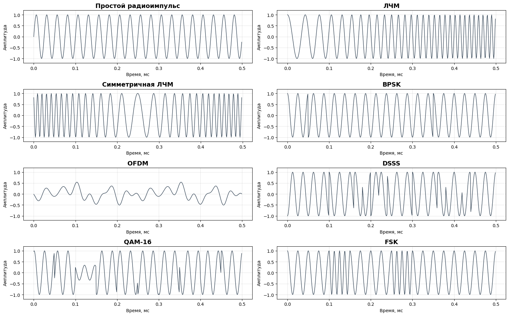
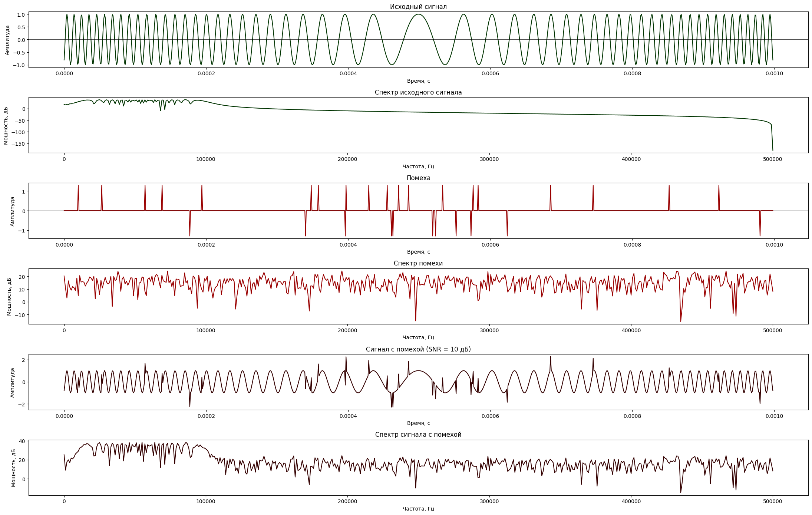
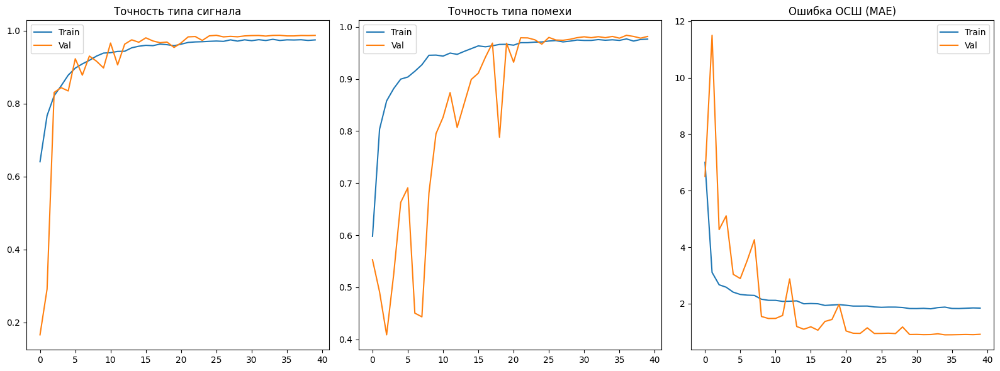
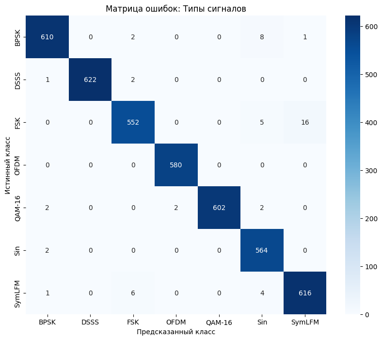
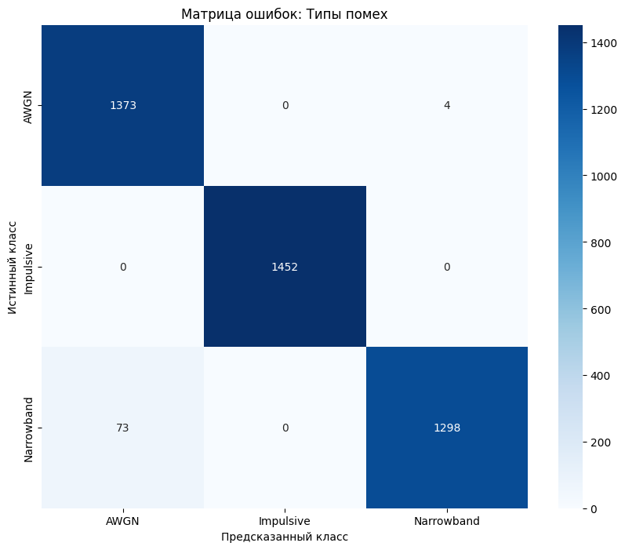
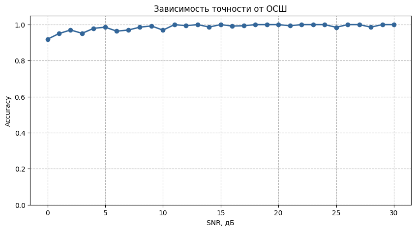
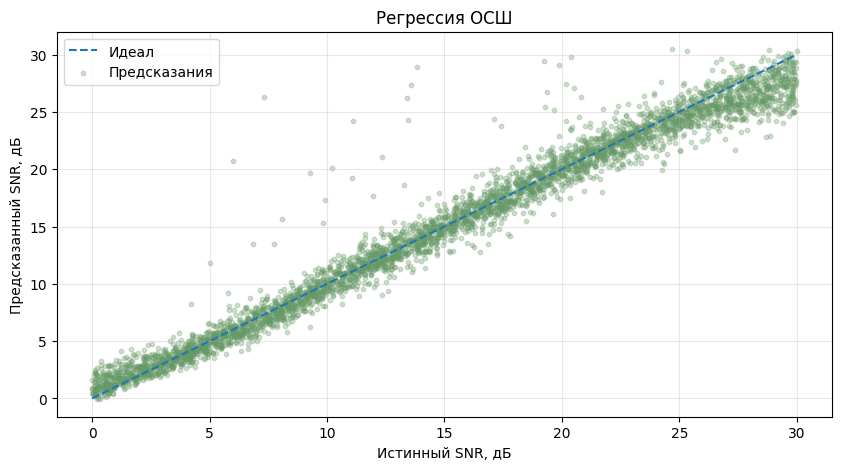
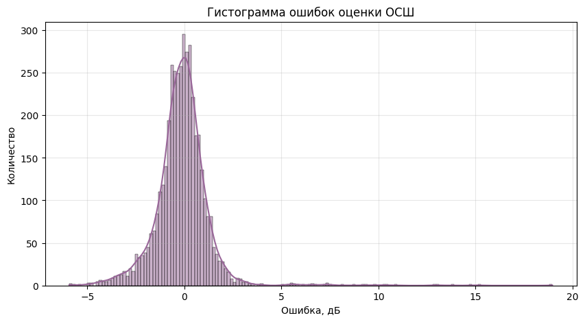

# RF-Signal-DeepLearning-Classification

## Классификация типов модуляции и помех радиосигналов с использованием многозадачной сверточной нейронной сети

## Цель проекта
Разработка компьютерной модели классификации радиосигналов и оценки параметров канала в условиях сложных помех. Система решает три задачи одновременно (Multi-task): определение типа модуляции, типа помехи и уровня сигнал/шум (SNR).

В классической радиотехнике задача обнаружения и распознавания решается двумя основными методами:

* **Согласованный фильтр**. Является оптимальным согласно критерию Неймана-Пирсона (максимизация вероятности обнаружения при фиксированной ложной тревоге). Однако требует детерминированных условий - априорного знания параметров сигнала (фаза, частота, длительность) и оптимален только в условиях белого шума.

* **Энергетический детектор**. Универсальный непараметрический метод, который не требует знания формы сигнала. Его главный минус - высокая чувствительность к нестабильности уровня шума и невозможность различить полезный сигнал и помеху при схожих энергиях.

**Проблема**: в реальных условиях (нестационарные помехи, импульсные шумы, узкополосные наводки) математические предположения классических методов нарушаются. Согласованный фильтр теряет эффективность при малейшем рассогласовании, а энергетический детектор выдает массу пропусков сигналов или ложных тревог. Важное преимущество ИНС перед классической последовательностью согласованных фильтров - фиксированная вычислительная сложность. Для распознавания N типов сигналов классический подход требует N последовательных или параллельных вычислений. Многозадачная нейросеть выполняет классификацию и оценку параметров за один прямой проход, обеспечивая одинаковое время принятия решения.

В данном проекте применяется глубокое обучение (Deep Learning) - используется сверточная нейронная сеть (CNN) для автоматического извлечения признаков. Нейросеть способна выявлять сложные нелинейные зависимости в данных, адаптируясь к нестационарным и недетерминированным помехам.

## Технические характеристики модели
* Архитектура - многозадачная нейронная сеть (Multi-task Learning) на основе 1D CNN.
* Входные данные - необработанные временные отсчеты сигнала.
* Выходы модели:
  1. Тип модуляции (7 классов): простой радиоимпульс, LFM, симметричная LFM, BPSK, FSK, OFDM, DSSS, QAM-16.
  2. Тип помехи (3 класса): белый шум (AWGN), узкополосная помеха (Narrowband), импульсная помеха (Impulsive).
  3. Оценка ОСШ (Регрессия): определение отношения сигнал/шум в дБ.

## Технологический стек
* Simulation & Synthesis: `NumPy` (моделирование сигналов).
* Data Processing: `Pandas`, `Scikit-learn` (нормализация данных, кодирование меток классов, разбиение на выборки).
* Deep Learning: `TensorFlow` / `Keras` (проектирование и обучение многозадачной сверточной нейросети).
* Analytics & Metrics: `Scikit-learn` (матрицы ошибок, F1-score, MSE и др.).
* Visualization: `Matplotlib`, `Seaborn` (визуализация сигналов, спектров и графиков обучения).

# Структура пайплайна
### 1. Моделирование сигналов и помех, синтез данных
На этом этапе формируется библиотека из 7 типов сигналов и 3 типов помех.
Используемые сигналы:

  * Прямоугольный радиоимпульс - синусоида с заданной частотой и длительностью.
  * ЛЧМ (линейная частотная модуляция) - сигнал с плавно изменяющейся частотой, обеспечивающий высокую устойчивость к шуму.
  * Симметричный ЛЧМ - зеркальная структура ЛЧМ, снижающая побочные отклики при обработке.
  * BPSK (фазовая манипуляция) - сигнал, где информация заложена в скачкообразном изменении фазы.
  * FSK (частотная манипуляция) - сигнал, в котором биты информации передаются переключением между двумя дискретными частотами.
  * QAM-16 (квадратурная амплитудная манипуляция) - сложный вид модуляции, где меняется и амплитуда, и фаза, что позволяет передавать больше данных в той же полосе.
  * OFDM (мультитональный сигнал) - набор ортогональных поднесущих, используемый в современных широкополосных системах связи и РЛС.
  * DSSS (прямое расширение спектра) - сигнал, модулированный псевдослучайной последовательностью для повышения скрытности.

Типы помех:
  * Белый гауссовский шум - естественный тепловой шум с равномерным спектром.
  * Импульсная помеха - кратковременные мощные выбросы, характерные для природных разрядов или работы систем радиоподавления.
  * Узкополосная (полосовая) помеха - случайный сигнал в ограниченной полосе частот, имитирующий работу других передатчиков или прицельные помехи.

*Прежде чем попасть в нейросеть, сигнал смешивается с помехой. Ниже приведен пример ЛЧМ-сигнала, искаженного мощной импульсной помехой при уровне ОСШ 10 дБ.*

### 2. Препроцессинг и подготовка
Нормировка сигналов к единичной мощности для корректного расчета ОСШ Масштабирование (StandardScaler) для стабилизации работы нейросети.
Преобразование данных в формат тензоров для подачи на вход CNN.

*В ходе работы проводились эксперименты по обучению модели на спектрах сигналов. Однако лучшие результаты были получены при использовании сырых временных отсчетов. Это скорее всего связано с тем, что сверточные слои могут напрямую извлекать информацию не только о частоте, но и об изменениях фазы и амплитуды во времени. При переходе только к спектру часть этих данных (особенно фазовых) теряется, что снижает точность классификации.*

### 3. Архитектура нейросети и обучение
Использование многозадачной архитектуры (Multi-task Learning) позволяет одной модели одновременно выполнять три операции: классификацию типа сигнала - модуляции (Softmax), классификацию типа помехи (Softmax) и регрессию значения ОСШ (Linear).

*Кривые обучения модели: точность классификации сигналов/помех и ошибка оценки ОСШ (MAE) по эпохам.*

### 4. Анализ эффективности и оценка метрик
* Классификация: расчет точности (Accuracy) и F1-score для каждого типа модуляции и помехи.
* Регрессия: оценка точности определения ОСШ через метрики MAE (средняя абсолютная ошибка) и R2 (коэффициент детерминации).
* Визуальный анализ: построение матриц ошибок,графика зависимости точности от уровня ОСШ (Accuracy vs SNR).

## Результаты
Модель показала высокую эффективность в задачах распознавания и регрессии даже в условиях высокого уровня помех (SNR от 0 дБ).

Средняя точность (Accuracy) по всем типам сигналов составила 99%.

| Тип сигнала | Precision | Recall | F1-score |
| :--- | :---: | :---: | :---: |
| DSSS / OFDM / QAM-16 | 1.00 | 1.00 | 1.00 |
| BPSK | 0.99 | 0.98 | 0.99 |
| FSK / Sin / SymLFM | 0.97 | 0.98 | 0.98 |

 

*Матрицы ошибок: Высокая разделимость классов. Незначительные смешения наблюдаются только между FSK и Sin на критических уровнях шума.*

Данная нейросеть сохраняет точность выше 90% даже при SNR=0 дБ, что недостижимо для классических детекторов без априорного знания структуры сигнала.

Модель успешно справляется с оценкой мощности шума. Общий коэффициент детерминации R^2 = 0.9730, что подтверждает высокую точность регрессии.

Средняя абсолютная ошибка (MAE): 1.2 дБ.

  - Лучшие показатели у SymLFM (0.65 дБ) и BPSK (0.72 дБ).

  - Наибольшая ошибка наблюдается у QAM-16 (1.29 дБ) и OFDM (1.20 дБ).

  Это объясняется сложностью амплитудной структуры этих сигналов, которую модель может частично принимать за флуктуации помехи.

  Оценка при AWGN (0.63 дБ) значительно точнее, чем при импульсных или узкополосных помехах (~1.0 дБ), так как последние вносят нестационарные искажения в оценку общей мощности.

